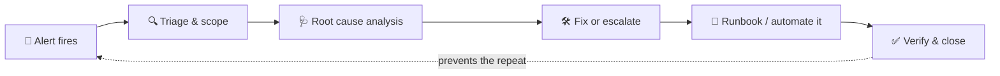

<!-- ===== HEADER: Terminal Banner + Typing Animation ===== -->

---

**☁️ Cloud Operations · 🐳 Kubernetes · 🐧 Linux · 📊 Observability · ⚙️ Automation**

---

### 👨‍💻 About Me

I keep mission-critical SaaS platforms running around the clock for **50+ Fortune 500 customers**. When production breaks, I get the alert, find the root cause, fix what's in scope, and write the runbook so it doesn't happen again.

- 🔭 Currently a **Cloud Services Specialist NOC Engineer** at PTC, running 24×7 operations on AWS & Azure
- 🌱 Extending production ops into **infrastructure-as-code and CI/CD** — Terraform, GitHub Actions & Bicep in my own projects; CKA and AWS SAA next up
- 🎓 Pursuing an **MBA at Manipal University Jaipur** — Dual Specialization: Information Systems Management / Analytics & Data Science
- ⚡ Fun fact: I learn fast and apply under real production pressure — give me a hard problem and I'll figure it out

| 🎯 Incidents Resolved | ⏱️ Uptime | 🏢 Fortune 500 | 📘 Runbooks | 🗓️ Experience |
|:---:|:---:|:---:|:---:|:---:|
| **5,000+** | **99.9%** | **50+** | **10+** | **3+ Years** |

---

### 🔧 What I Do

- **Incident Response** — Production incidents across AWS & Azure; triage, resolve, or escalate to senior teams
- **Root Cause Analysis** — Log analysis in Sumo Logic and Windchill logs to find and fix the real cause; act on alerts surfaced through AWS CloudWatch
- **Kubernetes (AKS)** — Pod & node troubleshooting with kubectl and k9s — CrashLoopBackOff, OOMKilled, scale-downs
- **Linux & Middleware** — 200+ production servers; Apache, Tomcat, Apache DS, Red Hat Directory Server
- **Monitoring** — Own the alert lifecycle in Zabbix: acknowledge, investigate, resolve or escalate, verify, close — plus go-live monitoring setup & validation
- **Ownership** — Raise change requests, run scheduled maintenance, author 10+ runbooks the team relies on

The same loop, every time — whether it's a 3am page at PTC or one of the automated reactors in my own projects below:

---

### 🛠️ Tech Stack

**Cloud & Containers**

<img src="https://img.shields.io/badge/AWS-232F3E?style=flat-square&logo=data:image/svg%2Bxml;base64,PHN2ZyB2aWV3Qm94PSIwIDAgMTI4IDEyOCIgeG1sbnM9Imh0dHA6Ly93d3cudzMub3JnLzIwMDAvc3ZnIj4KCTxwYXRoIGZpbGw9IiMyNTJmM2UiIGQ9Ik0zNi4zNzkgNTMuNjRjMCAxLjU2LjE2OCAyLjgyNS40NjUgMy43NS4zMzYuOTI2Ljc1OCAxLjkzOCAxLjM0NyAzLjAzMi4yMDcuMzM2LjI5My42NzIuMjkzLjk2OSAwIC40MTgtLjI1NC44NC0uOCAxLjI2MWwtMi42NTMgMS43N2MtLjM3OS4yNS0uNzU4LjM3OS0xLjA5My4zNzktLjQyMiAwLS44NDQtLjIxMS0xLjI2Ni0uNTlhMTMuMjggMTMuMjggMCAwIDEtMS41MTYtMS45OCAzNC4xNTMgMzQuMTUzIDAgMCAxLTEuMzA0LTIuNDg1Yy0zLjI4MiAzLjg3NS03LjQxIDUuODEzLTEyLjM4IDUuODEzLTMuNTM1IDAtNi4zNTUtMS4wMTItOC40MjEtMy4wMzItMi4wNjMtMi4wMjMtMy4xMTQtNC43MTgtMy4xMTQtOC4wODYgMC0zLjU3OCAxLjI2Mi02LjQ4NCAzLjgzMy04LjY3MSAyLjU2Ni0yLjE5MiA1Ljk3Ni0zLjI4NiAxMC4zMTYtMy4yODYgMS40MyAwIDIuOTAyLjEyNSA0LjQ2LjMzNiAxLjU2LjIxMSAzLjE2MS41NDcgNC44NDUuOTI2di0zLjA3NGMwLTMuMi0uNjc2LTUuNDMtMS45OC02LjczNEMyNi4wNjEgMzIuNjMzIDIzLjc4OCAzMiAyMC41NDYgMzJjLTEuNDczIDAtMi45ODguMTY4LTQuNTQ3LjU0N2EzMy40MTYgMzMuNDE2IDAgMCAwLTQuNTQ3IDEuNDMzYy0uNjc2LjI5My0xLjE4LjQ2MS0xLjQ3My41NDctLjI5Ni4wODItLjUwNy4xMjUtLjY3NS4xMjUtLjU5IDAtLjg4My0uNDIyLS44ODMtMS4zMDR2LTIuMDYzYzAtLjY3Ni4wODItMS4xOC4yOTMtMS40NzYuMjEtLjI5My41OS0uNTg2IDEuMTgtLjg4MyAxLjQ3Mi0uNzU4IDMuMjQyLTEuMzkgNS4zMDQtMS44OTUgMi4wNjMtLjU0NyA0LjI1NC0uOCA2LjU3LS44IDUuMDA4IDAgOC42NzIgMS4xMzYgMTEuMDMyIDMuNDEgMi4zMTYgMi4yNzMgMy40OTIgNS43MjYgMy40OTIgMTAuMzU5djEzLjY0Wm0tMTcuMDk0IDYuNDAzYzEuMzg3IDAgMi44Mi0uMjU0IDQuMzM2LS43NTggMS41MTYtLjUwOCAyLjg2My0xLjQzMyA0LTIuNjk1LjY3Mi0uOCAxLjE4LTEuNjg0IDEuNDMtMi42OTUuMjU0LTEuMDEyLjQyMi0yLjIzLjQyMi0zLjY2NXYtMS43NjVhMzQuNDAxIDM0LjQwMSAwIDAgMC0zLjg3MS0uNzE5IDMxLjgxNiAzMS44MTYgMCAwIDAtMy45NjEtLjI1Yy0yLjgyIDAtNC44ODMuNTQ3LTYuMjc0IDEuNjg0LTEuMzg3IDEuMTM2LTIuMDYyIDIuNzM0LTIuMDYyIDQuODQgMCAxLjk4LjUwNCAzLjQ1MyAxLjU1OCA0LjQ2NCAxLjAxMiAxLjA1MSAyLjQ4NSAxLjU1OSA0LjQyMiAxLjU1OVptMzMuODA5IDQuNTQ3Yy0uNzU4IDAtMS4yNjItLjEyNS0xLjU5OC0uNDIyLS4zNC0uMjU0LS42MzMtLjg0LS44ODctMS42NEw0MC43MTUgMjkuOThjLS4yNS0uODQzLS4zOC0xLjM5LS4zOC0xLjY4NyAwLS42NzIuMzM3LTEuMDUgMS4wMTMtMS4wNWg0LjEyNWMuOCAwIDEuMzQ3LjEyNCAxLjY0NC40MjEuMzM2LjI1LjU5Ljg0Ljg0IDEuNjRsNy4wNzQgMjcuODc2IDYuNTctMjcuODc1Yy4yMDgtLjg0LjQ2Mi0xLjM5Ljc5Ny0xLjY0LjM0LS4yNTUuOTMtLjQyMyAxLjY4OC0uNDIzaDMuMzY3Yy44IDAgMS4zNDguMTI1IDEuNjg0LjQyMi4zMzYuMjUuNjMzLjg0LjggMS42NGw2LjY1MyAyOC4yMTIgNy4yODUtMjguMjExYy4yNS0uODQuNTQ3LTEuMzkuODQtMS42NC4zMzYtLjI1NS44ODctLjQyMyAxLjY0NC0uNDIzaDMuOTE0Yy42NzYgMCAxLjA1NS4zMzYgMS4wNTUgMS4wNTEgMCAuMjEtLjA0My40MjItLjA4Ni42NzYtLjA0My4yNTQtLjEyNS41OS0uMjkzIDEuMDVMODAuODAxIDYyLjU3Yy0uMjU0Ljg0LS41NDcgMS4zODctLjg4NyAxLjY0LS4zMzYuMjU1LS44ODMuNDIzLTEuNTk4LjQyM2gtMy42MmMtLjgwMSAwLTEuMzQ4LS4xMy0xLjY4NC0uNDIyLS4zNC0uMjk3LS42MzMtLjg0NC0uODAxLTEuNjg0bC02LjUyNy0yNy4xNi02LjQ4NSAyNy4xMTdjLS4yMS44NDQtLjQ2IDEuMzkxLS44IDEuNjg0LS4zMzcuMjk3LS45MjYuNDIyLTEuNjg0LjQyMlptNTQuMTA1IDEuMTM3Yy0yLjE4NyAwLTQuMzc5LS4yNTQtNi40ODQtLjc1OC0yLjEwNi0uNTA0LTMuNzQ2LTEuMDU1LTQuODQtMS42ODQtLjY3Ni0uMzc5LTEuMTM3LS44LTEuMzA1LTEuMThhMi45MTkgMi45MTkgMCAwIDEtLjI1NC0xLjE4di0yLjE0OGMwLS44ODIuMzM2LTEuMzA0Ljk3LTEuMzA0LjI1IDAgLjUwMy4wNDMuNzU3LjEyOS4yNS4wODIuNjI5LjI1IDEuMDUuNDE4YTIzLjEwMiAyMy4xMDIgMCAwIDAgNC42MzQgMS40NzZjMS42ODMuMzM2IDMuMzI0LjUwNCA1LjAxMS41MDQgMi42NTMgMCA0LjcxNS0uNDY1IDYuMTQ1LTEuMzkgMS40MzMtLjkyNiAyLjE5MS0yLjI3NCAyLjE5MS00IDAtMS4xOC0uMzc5LTIuMTQ1LTEuMTM2LTIuOTQ2LS43NTgtLjgtMi4xOTItMS41MTYtNC4yNTQtMi4xOTFsLTYuMTA2LTEuODk1Yy0zLjA3NC0uOTY5LTUuMzQ4LTIuMzk4LTYuNzM0LTQuMjkzLTEuMzktMS44NTUtMi4xMDYtMy45MTgtMi4xMDYtNi4xMDUgMC0xLjc3LjM4LTMuMzI4IDEuMTM3LTQuNjc2YTEwLjgyOSAxMC44MjkgMCAwIDEgMy4wMzEtMy40NTNjMS4yNjItLjk2NSAyLjY5Ni0xLjY4NCA0LjM4LTIuMTg4IDEuNjgzLS41MDQgMy40NTItLjcxNSA1LjMwNC0uNzE1LjkyNiAwIDEuODk0LjA0MyAyLjgyLjE2OC45NjkuMTI1IDEuODUyLjI5MyAyLjczOC40NjEuODQuMjExIDEuNjQxLjQyMiAyLjM5OS42NzYuNzU4LjI1NCAxLjM0OC41MDQgMS43Ny43NTguNTkuMzM2IDEuMDExLjY3MiAxLjI2MSAxLjA1LjI1NC4zNC4zNzkuODAyLjM3OSAxLjM5MXYxLjk4YzAgLjg4NC0uMzM2IDEuMzQ4LS45NjkgMS4zNDgtLjMzNiAwLS44ODMtLjE3MS0xLjU5Ny0uNTA3LTIuNDAzLTEuMDk0LTUuMDk4LTEuNjQxLTguMDg2LTEuNjQxLTIuMzk5IDAtNC4yOTMuMzc5LTUuNTk4IDEuMTgtMS4zMDkuNzk3LTEuOTggMi4wMi0xLjk4IDMuNzQ2IDAgMS4xOC40MjEgMi4xOTEgMS4yNjEgMi45ODguODQ0LjggMi40MDMgMS42MDIgNC42MzMgMi4zMTZsNS45OCAxLjg5NWMzLjAzMi45NjkgNS4yMiAyLjMxNiA2LjUyNCA0LjA0MyAxLjMwNSAxLjcyNyAxLjkzOCAzLjcwNyAxLjkzOCA1Ljg5NSAwIDEuODEyLS4zOCAzLjQ1My0xLjA5NCA0Ljg4Mi0uNzU4IDEuNDM0LTEuNzcgMi42OTYtMy4wNzQgMy43MDctMS4zMDUgMS4wNTEtMi44NjQgMS44MDktNC42NzIgMi4zNi0xLjg5NS41ODYtMy44NzUuODgzLTYuMDI0Ljg4M1ptMCAwIi8+Cgk8cGF0aCBmaWxsPSIjZjkwIiBkPSJNMTE4IDczLjM0OGMtNC40MzIuMDYzLTkuNjY0IDEuMDUyLTEzLjYyMSAzLjgzMi0xLjIyMy44ODMtMS4wMTIgMi4wNjIuMzM2IDEuODk0IDQuNTA4LS41NDcgMTQuNDQtMS43MjYgMTYuMjEuNTQ3IDEuNzcgMi4yMy0xLjk3NiAxMS42Mi0zLjY2MyAxNS43OS0uNTA0IDEuMjYuNTkgMS43NjkgMS43MjYuOCA3LjQxLTYuMjMxIDkuMzQ4LTE5LjI0MiA3LjgzMi0yMS4xMzctLjc1Ny0uOTI1LTQuMzg4LTEuNzktOC44Mi0xLjcyNnpNMS42MyA3NS44NTljLS45MjcuMTE2LTEuMzQ3IDEuMjM2LS4zNjggMi4xMjEgMTYuNTA4IDE0LjkwMiAzOC4zNTkgMjMuODcyIDYyLjYxMyAyMy44NzIgMTcuMzA1IDAgMzcuNDMtNS40MyA1MS4yODEtMTUuNjYgMi4yNzMtMS42ODguMjk3LTQuMjU0LTIuMDItMy4yMDQtMTUuNTM0IDYuNTctMzIuNDIxIDkuNzctNDcuNzg4IDkuNzctMjIuNzc4IDAtNDQuOC02LjI3My02Mi42NTMtMTYuNjMzLS4zOS0uMjMxLS43NTUtLjMwNC0xLjA2NC0uMjY2eiIvPgo8L3N2Zz4=&logoColor=white" />

**Operating Systems & Scripting**

**Monitoring & Observability**

**ITSM**

**IaC & Automation**

**Currently Learning**

<img src="https://img.shields.io/badge/AWS_SAA-Prep-FF9900?style=flat-square&logo=data:image/svg%2Bxml;base64,PHN2ZyB2aWV3Qm94PSIwIDAgMTI4IDEyOCIgeG1sbnM9Imh0dHA6Ly93d3cudzMub3JnLzIwMDAvc3ZnIj4KCTxwYXRoIGZpbGw9IiMyNTJmM2UiIGQ9Ik0zNi4zNzkgNTMuNjRjMCAxLjU2LjE2OCAyLjgyNS40NjUgMy43NS4zMzYuOTI2Ljc1OCAxLjkzOCAxLjM0NyAzLjAzMi4yMDcuMzM2LjI5My42NzIuMjkzLjk2OSAwIC40MTgtLjI1NC44NC0uOCAxLjI2MWwtMi42NTMgMS43N2MtLjM3OS4yNS0uNzU4LjM3OS0xLjA5My4zNzktLjQyMiAwLS44NDQtLjIxMS0xLjI2Ni0uNTlhMTMuMjggMTMuMjggMCAwIDEtMS41MTYtMS45OCAzNC4xNTMgMzQuMTUzIDAgMCAxLTEuMzA0LTIuNDg1Yy0zLjI4MiAzLjg3NS03LjQxIDUuODEzLTEyLjM4IDUuODEzLTMuNTM1IDAtNi4zNTUtMS4wMTItOC40MjEtMy4wMzItMi4wNjMtMi4wMjMtMy4xMTQtNC43MTgtMy4xMTQtOC4wODYgMC0zLjU3OCAxLjI2Mi02LjQ4NCAzLjgzMy04LjY3MSAyLjU2Ni0yLjE5MiA1Ljk3Ni0zLjI4NiAxMC4zMTYtMy4yODYgMS40MyAwIDIuOTAyLjEyNSA0LjQ2LjMzNiAxLjU2LjIxMSAzLjE2MS41NDcgNC44NDUuOTI2di0zLjA3NGMwLTMuMi0uNjc2LTUuNDMtMS45OC02LjczNEMyNi4wNjEgMzIuNjMzIDIzLjc4OCAzMiAyMC41NDYgMzJjLTEuNDczIDAtMi45ODguMTY4LTQuNTQ3LjU0N2EzMy40MTYgMzMuNDE2IDAgMCAwLTQuNTQ3IDEuNDMzYy0uNjc2LjI5My0xLjE4LjQ2MS0xLjQ3My41NDctLjI5Ni4wODItLjUwNy4xMjUtLjY3NS4xMjUtLjU5IDAtLjg4My0uNDIyLS44ODMtMS4zMDR2LTIuMDYzYzAtLjY3Ni4wODItMS4xOC4yOTMtMS40NzYuMjEtLjI5My41OS0uNTg2IDEuMTgtLjg4MyAxLjQ3Mi0uNzU4IDMuMjQyLTEuMzkgNS4zMDQtMS44OTUgMi4wNjMtLjU0NyA0LjI1NC0uOCA2LjU3LS44IDUuMDA4IDAgOC42NzIgMS4xMzYgMTEuMDMyIDMuNDEgMi4zMTYgMi4yNzMgMy40OTIgNS43MjYgMy40OTIgMTAuMzU5djEzLjY0Wm0tMTcuMDk0IDYuNDAzYzEuMzg3IDAgMi44Mi0uMjU0IDQuMzM2LS43NTggMS41MTYtLjUwOCAyLjg2My0xLjQzMyA0LTIuNjk1LjY3Mi0uOCAxLjE4LTEuNjg0IDEuNDMtMi42OTUuMjU0LTEuMDEyLjQyMi0yLjIzLjQyMi0zLjY2NXYtMS43NjVhMzQuNDAxIDM0LjQwMSAwIDAgMC0zLjg3MS0uNzE5IDMxLjgxNiAzMS44MTYgMCAwIDAtMy45NjEtLjI1Yy0yLjgyIDAtNC44ODMuNTQ3LTYuMjc0IDEuNjg0LTEuMzg3IDEuMTM2LTIuMDYyIDIuNzM0LTIuMDYyIDQuODQgMCAxLjk4LjUwNCAzLjQ1MyAxLjU1OCA0LjQ2NCAxLjAxMiAxLjA1MSAyLjQ4NSAxLjU1OSA0LjQyMiAxLjU1OVptMzMuODA5IDQuNTQ3Yy0uNzU4IDAtMS4yNjItLjEyNS0xLjU5OC0uNDIyLS4zNC0uMjU0LS42MzMtLjg0LS44ODctMS42NEw0MC43MTUgMjkuOThjLS4yNS0uODQzLS4zOC0xLjM5LS4zOC0xLjY4NyAwLS42NzIuMzM3LTEuMDUgMS4wMTMtMS4wNWg0LjEyNWMuOCAwIDEuMzQ3LjEyNCAxLjY0NC40MjEuMzM2LjI1LjU5Ljg0Ljg0IDEuNjRsNy4wNzQgMjcuODc2IDYuNTctMjcuODc1Yy4yMDgtLjg0LjQ2Mi0xLjM5Ljc5Ny0xLjY0LjM0LS4yNTUuOTMtLjQyMyAxLjY4OC0uNDIzaDMuMzY3Yy44IDAgMS4zNDguMTI1IDEuNjg0LjQyMi4zMzYuMjUuNjMzLjg0LjggMS42NGw2LjY1MyAyOC4yMTIgNy4yODUtMjguMjExYy4yNS0uODQuNTQ3LTEuMzkuODQtMS42NC4zMzYtLjI1NS44ODctLjQyMyAxLjY0NC0uNDIzaDMuOTE0Yy42NzYgMCAxLjA1NS4zMzYgMS4wNTUgMS4wNTEgMCAuMjEtLjA0My40MjItLjA4Ni42NzYtLjA0My4yNTQtLjEyNS41OS0uMjkzIDEuMDVMODAuODAxIDYyLjU3Yy0uMjU0Ljg0LS41NDcgMS4zODctLjg4NyAxLjY0LS4zMzYuMjU1LS44ODMuNDIzLTEuNTk4LjQyM2gtMy42MmMtLjgwMSAwLTEuMzQ4LS4xMy0xLjY4NC0uNDIyLS4zNC0uMjk3LS42MzMtLjg0NC0uODAxLTEuNjg0bC02LjUyNy0yNy4xNi02LjQ4NSAyNy4xMTdjLS4yMS44NDQtLjQ2IDEuMzkxLS44IDEuNjg0LS4zMzcuMjk3LS45MjYuNDIyLTEuNjg0LjQyMlptNTQuMTA1IDEuMTM3Yy0yLjE4NyAwLTQuMzc5LS4yNTQtNi40ODQtLjc1OC0yLjEwNi0uNTA0LTMuNzQ2LTEuMDU1LTQuODQtMS42ODQtLjY3Ni0uMzc5LTEuMTM3LS44LTEuMzA1LTEuMThhMi45MTkgMi45MTkgMCAwIDEtLjI1NC0xLjE4di0yLjE0OGMwLS44ODIuMzM2LTEuMzA0Ljk3LTEuMzA0LjI1IDAgLjUwMy4wNDMuNzU3LjEyOS4yNS4wODIuNjI5LjI1IDEuMDUuNDE4YTIzLjEwMiAyMy4xMDIgMCAwIDAgNC42MzQgMS40NzZjMS42ODMuMzM2IDMuMzI0LjUwNCA1LjAxMS41MDQgMi42NTMgMCA0LjcxNS0uNDY1IDYuMTQ1LTEuMzkgMS40MzMtLjkyNiAyLjE5MS0yLjI3NCAyLjE5MS00IDAtMS4xOC0uMzc5LTIuMTQ1LTEuMTM2LTIuOTQ2LS43NTgtLjgtMi4xOTItMS41MTYtNC4yNTQtMi4xOTFsLTYuMTA2LTEuODk1Yy0zLjA3NC0uOTY5LTUuMzQ4LTIuMzk4LTYuNzM0LTQuMjkzLTEuMzktMS44NTUtMi4xMDYtMy45MTgtMi4xMDYtNi4xMDUgMC0xLjc3LjM4LTMuMzI4IDEuMTM3LTQuNjc2YTEwLjgyOSAxMC44MjkgMCAwIDEgMy4wMzEtMy40NTNjMS4yNjItLjk2NSAyLjY5Ni0xLjY4NCA0LjM4LTIuMTg4IDEuNjgzLS41MDQgMy40NTItLjcxNSA1LjMwNC0uNzE1LjkyNiAwIDEuODk0LjA0MyAyLjgyLjE2OC45NjkuMTI1IDEuODUyLjI5MyAyLjczOC40NjEuODQuMjExIDEuNjQxLjQyMiAyLjM5OS42NzYuNzU4LjI1NCAxLjM0OC41MDQgMS43Ny43NTguNTkuMzM2IDEuMDExLjY3MiAxLjI2MSAxLjA1LjI1NC4zNC4zNzkuODAyLjM3OSAxLjM5MXYxLjk4YzAgLjg4NC0uMzM2IDEuMzQ4LS45NjkgMS4zNDgtLjMzNiAwLS44ODMtLjE3MS0xLjU5Ny0uNTA3LTIuNDAzLTEuMDk0LTUuMDk4LTEuNjQxLTguMDg2LTEuNjQxLTIuMzk5IDAtNC4yOTMuMzc5LTUuNTk4IDEuMTgtMS4zMDkuNzk3LTEuOTggMi4wMi0xLjk4IDMuNzQ2IDAgMS4xOC40MjEgMi4xOTEgMS4yNjEgMi45ODguODQ0LjggMi40MDMgMS42MDIgNC42MzMgMi4zMTZsNS45OCAxLjg5NWMzLjAzMi45NjkgNS4yMiAyLjMxNiA2LjUyNCA0LjA0MyAxLjMwNSAxLjcyNyAxLjkzOCAzLjcwNyAxLjkzOCA1Ljg5NSAwIDEuODEyLS4zOCAzLjQ1My0xLjA5NCA0Ljg4Mi0uNzU4IDEuNDM0LTEuNzcgMi42OTYtMy4wNzQgMy43MDctMS4zMDUgMS4wNTEtMi44NjQgMS44MDktNC42NzIgMi4zNi0xLjg5NS41ODYtMy44NzUuODgzLTYuMDI0Ljg4M1ptMCAwIi8+Cgk8cGF0aCBmaWxsPSIjZjkwIiBkPSJNMTE4IDczLjM0OGMtNC40MzIuMDYzLTkuNjY0IDEuMDUyLTEzLjYyMSAzLjgzMi0xLjIyMy44ODMtMS4wMTIgMi4wNjIuMzM2IDEuODk0IDQuNTA4LS41NDcgMTQuNDQtMS43MjYgMTYuMjEuNTQ3IDEuNzcgMi4yMy0xLjk3NiAxMS42Mi0zLjY2MyAxNS43OS0uNTA0IDEuMjYuNTkgMS43NjkgMS43MjYuOCA3LjQxLTYuMjMxIDkuMzQ4LTE5LjI0MiA3LjgzMi0yMS4xMzctLjc1Ny0uOTI1LTQuMzg4LTEuNzktOC44Mi0xLjcyNnpNMS42MyA3NS44NTljLS45MjcuMTE2LTEuMzQ3IDEuMjM2LS4zNjggMi4xMjEgMTYuNTA4IDE0LjkwMiAzOC4zNTkgMjMuODcyIDYyLjYxMyAyMy44NzIgMTcuMzA1IDAgMzcuNDMtNS40MyA1MS4yODEtMTUuNjYgMi4yNzMtMS42ODguMjk3LTQuMjU0LTIuMDItMy4yMDQtMTUuNTM0IDYuNTctMzIuNDIxIDkuNzctNDcuNzg4IDkuNzctMjIuNzc4IDAtNDQuOC02LjI3My02Mi42NTMtMTYuNjMzLS4zOS0uMjMxLS43NTUtLjMwNC0xLjA2NC0uMjY2eiIvPgo8L3N2Zz4=&logoColor=white" />

---

### 📊 GitHub Stats

---

### 🚀 Featured Projects

Hands-on cloud & DevOps work that extends my production experience into automation, infrastructure-as-code, and platform engineering — all public, with a README covering design rationale for each:

- 📊 **[Zabbix Monitoring Lab — Platform Deep-Dive](https://github.com/dineshravichandiran/zabbix-monitoring-lab)** — self-hosted Zabbix lab going deeper into the platform-engineering side production work doesn't ask for. Verified so far: LLD discovery filters (with a real before/after item count) and a severity-escalation action (where I caught and fixed a real timing bug). JSONPath preprocessing, RBAC, and proxy architecture are next — the repo README tracks exact status per section, not just a feature list.
- ⚙️ **[Ansible: Zabbix Onboarding + Host Baseline](https://github.com/dineshravichandiran/ansible-zabbix-baseline)** — idempotent playbook taking a fresh host to monitored-and-hardened (chrony, scoped UFW, unattended upgrades, log rotation, Zabbix agent). Found and fixed two real bugs via testing against real systemd containers; a clean re-run verifies `changed=0`.
- 🧠 **[Salt Self-Healing Memory Guard](https://github.com/dineshravichandiran/salt-self-healing-memory)** — a custom Salt beacon watches a service's memory and a reactor restarts it before an OOM kill, closing a loop I've watched resolve the same way in production for years. Tested live against a real salt-master/minion pair; found and fixed two real bugs (a decommissioned bootstrap URL, and a reactor event-tag glob that silently never matched the beacon's tag). Three consecutive detect → restart → log cycles verified back to back.
- 🔐 **[End-to-End DevSecOps CI Pipeline](https://github.com/dineshravichandiran/cloud-devops-projects/tree/main/devsecops-ci-pipeline)** — a GitHub Actions pipeline gating every deployment behind secret scanning, SAST, SCA, container scanning, and DAST. Found and fixed 3 real failures blocking it end-to-end; runs fully green today. 
- ♻️ **[Self-Healing Infrastructure on AWS](https://github.com/dineshravichandiran/cloud-devops-projects/tree/main/self-healing-aws-infra)** — Terraform-provisioned VPC/ALB/Auto Scaling Group with CloudWatch alarms and Lambda-based auto-remediation for failure modes ASG health checks alone don't catch.
- 🔄 **[End-to-End Azure DevOps Project](https://github.com/dineshravichandiran/cloud-devops-projects/tree/main/azure-devops-pipeline)** — a multi-stage Azure DevOps pipeline that builds, security-scans, provisions infrastructure with Bicep, and promotes releases through dev → staging → production with approvals and slot swaps.
- ☁️ **[Static Resume Site on AWS](https://github.com/dineshravichandiran/resumefromstaticwebsite)** — static site hosted on S3 with global distribution via CloudFront and Route 53.

📝 Also on GitHub: a [Linux ops cheatsheet](https://github.com/dineshravichandiran/linux-ops-cheatsheet) of commands I actually use in production, and a [tech events journal](https://github.com/dineshravichandiran/tech-events-journal) of conference/meetup takeaways.

---

### 💡 Beyond Operations

I'm hands-on beyond just ops. I build interactive web experiences from scratch, with a working foundation in **web development (HTML, CSS, JavaScript)**, custom animations, and responsive design, and I enjoy bringing ideas to life in the browser. I also use AI tools (Microsoft Copilot, Claude, ChatGPT, Gemini) to learn faster and work more efficiently.

---

### 🏆 Achievements

- 🥇 **Winner — Smart India Hackathon 2020** (National Level) — 10,000+ competing teams
- ⭐ **Customer First Award — PTC** — Major incident recovery
- ⭐ **PTC Cheers Award** — Performance & Efficiency
- 🛡️ **DRDO R&D Intern** — Defence project (sensor integration)
- 📜 **Microsoft Certified** — AZ-900 & DP-900
- ☸️ **KubeCon + CloudNativeCon India** — Attended 2025 & 2026

---

***"Preparation beats panic, every time."*** — Learned from 3+ years of on-call rotations 🚀

