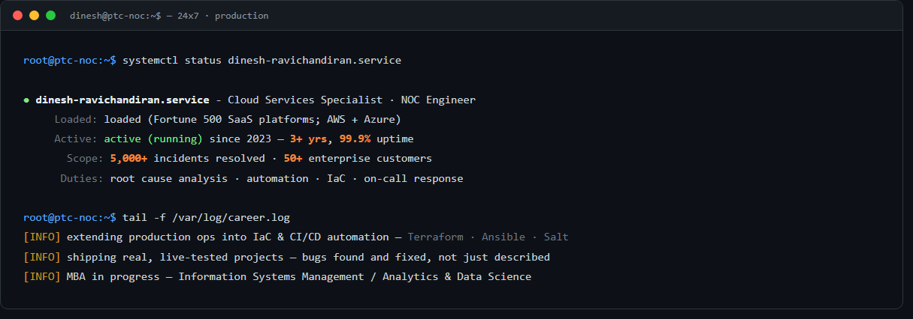
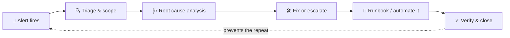

<!-- ===== HEADER: Terminal Banner + Typing Animation ===== -->
<div align="center">



[](https://git.io/typing-svg)


**_"Hope is not a strategy."_** — SRE folklore, and how I actually work

</div>

---

<div align="center">

**☁️ Cloud & SRE · 🤖 AI / AIOps · 🐳 Kubernetes · 📊 Observability · ⚙️ Automation**

[](https://github.com/dineshravichandiran)
[](https://linkedin.com/in/dineshravichandiran)
[](mailto:dineshravichandiran0808@gmail.com)
[](https://dinesh-ravichandiran.netlify.app/)
[](https://dinesh-ravichandiran.netlify.app/Dinesh_Ravichandiran_SRE.pdf)
[](https://www.credly.com/users/dineshravichandiran)

</div>

---

### 👨‍💻 About Me

```bash
$ whoami
> dinesh.ravichandiran · Cloud Services Specialist NOC Engineer @ PTC

$ cat ./now.txt
> Running 24x7 production ops on AWS & Azure for 50+ Fortune 500 customers
> Extending production ops into IaC/CI/CD — Terraform, GitHub Actions, Bicep
> Pursuing an MBA — Info Systems Management / Analytics & Data Science
> CKA in progress, AWS SAA next
```

I specialize in keeping production systems reliable at scale — incident response, root-cause engineering, and turning recurring failures into permanent, automated fixes instead of repeat manual work. I'd rather ship a working repo than talk about one — most of what's below was built hands-on, verified live (not just "looks right"), with an AI coding agent (Claude Code) in the loop the same way I'd use any other force-multiplier in production: to move faster, not to skip the verification.

### 🧭 Areas of Interest & Expertise

| | |
|---|---|
| **Site Reliability Engineering** | Incident response, RCA, blameless postmortems, on-call, SLI/SLO thinking |
| **AI / AIOps** | Event correlation, anomaly detection, ML-driven root-cause suggestion — the layer on top of traditional monitoring |
| **Cloud Infrastructure** | AWS & Azure, multi-cloud ops, cost & performance optimization |
| **Kubernetes & Containers** | AKS pod/node troubleshooting, kubectl, k9s — CKA in progress |
| **Observability** | Zabbix, Prometheus, Grafana, Sumo Logic, CloudWatch — full alert-lifecycle ownership |
| **Infrastructure as Code** | Terraform, Bicep, GitHub Actions, Ansible — repeatable over manual |
| **Automation & Self-Healing** | Salt beacons/reactors, event-driven remediation, cutting toil out of the loop |
| **ITSM & Incident Management** | ServiceNow, ITIL change/problem/incident process |

<div align="center">

| 🎯 Incidents Resolved | ⏱️ Uptime | 🏢 Fortune 500 | 📘 Runbooks | 🗓️ Experience |
|:---:|:---:|:---:|:---:|:---:|
| **5,000+** | **99.9%** | **50+** | **10+** | **3.5+ Years** |

</div>

---

### 🎯 Core Capabilities

- **Incident Response** — Triage, root-cause, and resolve production issues under real pressure, across AWS & Azure
- **Root Cause Analysis** — Turn a pile of logs and alerts into the actual root cause, not a surface-level fix
- **Kubernetes Troubleshooting** — Diagnose and resolve pod/node failures — CrashLoopBackOff, OOMKilled, scale-downs — with kubectl & k9s
- **Linux & Middleware Administration** — Manage and harden large production server fleets running Apache, Tomcat, and directory services
- **Monitoring & Observability** — Own the full alert lifecycle end-to-end, and validate monitoring coverage before something goes live
- **Process & Automation** — Turn recurring incidents into runbooks and automation instead of tribal knowledge and repeat manual fixes

The same loop, every time — whether it's a live production incident or one of the automated reactors in my own projects below:



---

### 🛠️ Tech Stack

**Cloud & Containers**
<p>


</p>

**Operating Systems & Scripting**
<p>


</p>

**Monitoring & Observability**
<p>


</p>

**Data & ML**
<p>


</p>

**Web (portfolio & side projects)**
<p>


</p>

**ITSM**
<p>


</p>

**IaC & Automation**
<p>


</p>

**AI Tools**
<p>


</p>

**Currently Learning**
<p>


</p>

---

### 📊 GitHub Activity

<div align="center">


</div>

---

### 🚀 Featured Projects

Hands-on cloud & DevOps work that extends my production experience into automation, infrastructure-as-code, AIOps, and platform engineering — all public, with a README covering design rationale for each:

- 🤖 **[AIOps Alert Correlation & RCA Engine](https://github.com/dineshravichandiran/aiops-alert-correlation)** — the ML half of AIOps on top of the operational half I already do daily: a sliding-window event correlator (76.9% noise reduction, 13,833 raw alerts → 3,197 real incidents), an IsolationForest anomaly detector, and a RandomForest root-cause classifier (56.8% accuracy vs. ~12.5% random-chance baseline). 8 passing tests.
- 📊 **[Grafana + Prometheus Observability Stack](https://github.com/dineshravichandiran/grafana-observability-stack)** — dashboards and alert rules provisioned entirely as code over a synthetic metrics exporter, not clicked together by hand. Verified running live in a GitHub Codespace, not just locally.
- 📈 **[Cloud Incident & Reliability Analytics](https://github.com/dineshravichandiran/cloud-incident-analytics)** — a synthetic, seeded incident dataset plus a full Tableau dashboard brief (SLI/SLO tracking, MTTR trend, root-cause Pareto, forecasting) bridging production ops with the analytics side of my MBA.
- 📡 **[Zabbix Monitoring Lab — Platform Deep-Dive](https://github.com/dineshravichandiran/zabbix-monitoring-lab)** — self-hosted Zabbix lab going deeper into the platform-engineering side production work doesn't ask for. Verified so far: LLD discovery filters (with a real before/after item count) and a severity-escalation action (where I caught and fixed a real timing bug). The repo README tracks exact status per section, not just a feature list.
- ⚙️ **[Ansible: Zabbix Onboarding + Host Baseline](https://github.com/dineshravichandiran/ansible-zabbix-baseline)** — idempotent playbook taking a fresh host to monitored-and-hardened (chrony, scoped UFW, unattended upgrades, log rotation, Zabbix agent). Found and fixed two real bugs via testing against real systemd containers; a clean re-run verifies `changed=0`.
- 🧠 **[Salt Self-Healing Memory Guard](https://github.com/dineshravichandiran/salt-self-healing-memory)** — a custom Salt beacon watches a service's memory and a reactor restarts it before an OOM kill, closing a loop I've watched resolve the same way in production for years. Three consecutive detect → restart → log cycles verified back to back.
- 🔐 **[End-to-End DevSecOps CI Pipeline](https://github.com/dineshravichandiran/cloud-devops-projects/tree/main/devsecops-ci-pipeline)** — a GitHub Actions pipeline gating every deployment behind secret scanning, SAST, SCA, container scanning, and DAST. Found and fixed 3 real failures blocking it end-to-end; runs fully green today. [](https://github.com/dineshravichandiran/cloud-devops-projects/actions/workflows/devsecops-pipeline.yml)
- ♻️ **[Self-Healing Infrastructure on AWS](https://github.com/dineshravichandiran/cloud-devops-projects/tree/main/self-healing-aws-infra)** — Terraform-provisioned VPC/ALB/Auto Scaling Group with CloudWatch alarms and Lambda-based auto-remediation for failure modes ASG health checks alone don't catch.
- 🔄 **[End-to-End Azure DevOps Project](https://github.com/dineshravichandiran/cloud-devops-projects/tree/main/azure-devops-pipeline)** — a multi-stage Azure DevOps pipeline that builds, security-scans, provisions infrastructure with Bicep, and promotes releases through dev → staging → production with approvals and slot swaps.
- ☁️ **[Static Resume Site on AWS](https://github.com/dineshravichandiran/resumefromstaticwebsite)** — static site hosted on S3 with global distribution via CloudFront and Route 53.
- 🌐 **[Personal Portfolio](https://github.com/dineshravichandiran/Portfolio)** — this profile's portfolio site: React, TypeScript, Three.js, GSAP — a custom 3D career-journey experience and a hand-built monitoring/status-page visual identity, not a template.

📝 Also on GitHub: a [Linux ops cheatsheet](https://github.com/dineshravichandiran/linux-ops-cheatsheet) of commands I actually use in production, and a [tech events journal](https://github.com/dineshravichandiran/tech-events-journal) of conference/meetup takeaways.

---

### 🤝 Open Source & Writing

**In progress, not yet shipped** — being upfront about where I actually am:

- 🌱 **External open-source contributions** — haven't sent a PR to someone else's project yet; it's next on the list once the current self-directed projects above are in good shape.
- ✍️ **Technical writing** — no public blog yet. The plan is to write up the real bugs and fixes behind the projects above (the Ansible idempotency bug, the Salt reactor tag mismatch, the DevSecOps pipeline failures) rather than generic tutorials.

---

### 💡 Beyond Operations

I'm hands-on beyond just ops. I build interactive web experiences from scratch, with a working foundation in **web development (HTML, CSS, JavaScript)**, custom animations, and responsive design, and I enjoy bringing ideas to life in the browser. I also use AI tools (Claude, Microsoft Copilot, ChatGPT, Gemini) to learn faster and work more efficiently.

---

### 🏆 Achievements

- 🥇 **Winner — Smart India Hackathon 2020** (National Level) — 10,000+ competing teams
- ⭐ **Customer First Award — PTC** — Major incident recovery
- ⭐ **PTC Cheers Award** — Performance & Efficiency
- 🛡️ **DRDO R&D Intern** — Defence project (sensor integration)
- 📜 **Microsoft Certified** — AZ-900 & DP-900
- ☸️ **KubeCon + CloudNativeCon India** — Attended 2025 & 2026

---

### 🤝 Let's Talk

Long-term, I want to be someone who's genuinely helped as many people in IT as possible get where they're trying to go — mentorship calls today, open-source contributions and technical writing next.

<div align="center">

**1:1 sessions on job interview tips, career guidance, and interview prep — ★ 5/5**

[](https://topmate.io/dinesh_ravichandiran/)

| Career Guidance | Resume Review | 1:1 Mentorship | Quick Insights / Doubt Clearing | Priority DM |
|:---:|:---:|:---:|:---:|:---:|

</div>

---

<div align="center">

***"Preparation beats panic, every time."*** — Learned from 3.5+ years of on-call rotations 🚀

</div>
