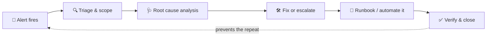

<!-- ===== HEADER: Wave Banner + Typing Animation ===== -->
<div align="center">


[;On+a+mission+to+make+downtime+obsolete;Turning+%22it+broke+again%22+into+%22it+can't+break+again%22)](https://git.io/typing-svg)


[](https://dinesh-ravichandiran.netlify.app/)

**_"Hope is not a strategy."_** — SRE folklore, and how I actually work

</div>

---

<div align="center">

**🎯 Site Reliability Engineering · 🤖 AI / AIOps · 🐳 Kubernetes · 📊 Observability · ⚙️ Automation**

[](https://github.com/dineshravichandiran)
[](https://linkedin.com/in/dineshravichandiran)
[](mailto:dineshravichandiran0808@gmail.com)
[](https://dinesh-ravichandiran.netlify.app/)
[](https://dinesh-ravichandiran.netlify.app/Dinesh_Ravichandiran_SRE.pdf)
[](https://www.credly.com/users/dineshravichandiran)
[](https://dev.to/dinesh_ravichandiran)
[](https://hashnode.com/@dinesh101)

</div>

---

### 👨‍💻 About Me

```python
class DineshRavichandiran:
    def __init__(self):
        self.role = "Site Reliability Engineer (SRE-focused), 3.5+ years in production"
        self.company = "PTC"
        self.location = "Pune, India"
        self.mission = "Making downtime obsolete, one root cause at a time"

    @property
    def now(self):
        return [
            "24x7 incident response & observability for 50+ Fortune 500 customers",
            "Extending production ops into IaC/CI-CD — Terraform, GitHub Actions, Bicep",
            "Building AIOps, Kubernetes self-healing, and chaos-tested automation",
            "CKA in progress, AWS SAA next",
        ]

    @property
    def skills(self):
        return {
            "cloud": ["AWS", "Azure", "Kubernetes", "Docker"],
            "observability": ["Zabbix", "Prometheus", "Grafana", "Sumo Logic", "CloudWatch"],
            "iac_automation": ["Terraform", "Bicep", "GitHub Actions", "Ansible", "SaltStack"],
            "scripting": ["Bash", "Python"],
        }

    @property
    def track_record(self):
        return "5,000+ incidents resolved · 99.9% uptime · 10+ runbooks authored"
```

Production systems fail for a reason, not by chance — find the actual root cause and the failure stops recurring, permanently. That's the job: incident response, root-cause engineering, and turning repeat manual fixes into automation that doesn't need a human at 2 a.m. Call it the Sherlock Holmes school of ops — the alert is never the crime, just the first clue.

I ship working systems, not slide decks about them. Everything below runs, is verified live, and is backed by numbers I can defend in an interview.

### 🧭 Core SRE Competencies

| | |
|---|---|
| **Incident Response & On-Call** | 24x7 rotation, triage, escalation, blameless postmortems, SLI/SLO thinking |
| **Root Cause Analysis** | Trend analysis on recurring alerts, turning repeat incidents into permanent fixes |
| **AIOps & AI-Driven Ops** | Event correlation, anomaly detection, ML-driven root-cause suggestion |
| **Kubernetes & Containers** | AKS pod/node troubleshooting, kubectl, k9s, chaos engineering — CKA in progress |
| **Observability** | Zabbix, Prometheus, Grafana, Sumo Logic, CloudWatch — full alert-lifecycle ownership |
| **Infrastructure as Code** | Terraform, Bicep, GitHub Actions, Ansible — repeatable over manual |
| **Automation & Self-Healing** | Salt beacons/reactors, event-driven remediation, cutting toil out of the loop |
| **Multi-Cloud** | AWS & Azure, cost & performance optimization at Fortune 500 scale |

<div align="center">

| 🎯 Incidents Resolved | ⏱️ Uptime | 🏢 Fortune 500 Customers | 📘 Runbooks Authored | 🗓️ Experience |
|:---:|:---:|:---:|:---:|:---:|
| **5,000+** | **99.9%** | **50+** | **10+** | **3.5+ Years** |

</div>

---

### 🎯 Core Capabilities

Six things I actually do, not six things I studied:

- **Incident Response** — Real pressure, real production, across AWS & Azure. No dress rehearsal.
- **Root Cause Analysis** — Logs are clues, not conclusions. Same method as a detective: gather the evidence, rule out the obvious suspect, find the one that actually did it.
- **Kubernetes Troubleshooting** — CrashLoopBackOff, OOMKilled, scale-downs — diagnosed and resolved with kubectl & k9s, not guessed at.
- **Linux & Middleware Administration** — Fleets, not laptops. Apache, Tomcat, directory services, hardened at scale.
- **Monitoring & Observability** — Own the alert lifecycle end-to-end. If it's not validated before go-live, it's not monitored.
- **Process & Automation** — A recurring incident is a bug in the *process*. Fix that, not just the symptom.

Same loop every time — a live production incident, or one of the automated reactors in the projects below:


```mermaid
flowchart LR
    A[🚨 Alert fires] --> B[🔍 Triage & scope]
    B --> C[🩺 Root cause analysis]
    C --> D[🛠️ Fix or escalate]
    D --> E[📘 Runbook / automate it]
    E --> F[✅ Verify & close]
    F -.->|prevents the repeat| A
```

---

### 🛠️ Tech Stack

**Cloud & Containers**
<p>


</p>

**Operating Systems & Scripting**
<p>


</p>

**Monitoring & Observability**
<p>


</p>

**Data & ML**
<p>


</p>

**IaC & Automation**
<p>


</p>

**ITSM**
<p>


</p>

**Web (portfolio & side projects)**
<p>


</p>

**Currently Learning**
<p>


</p>

---

### 📊 GitHub Activity

<div align="center">


</div>

---

### 🚀 Featured Projects

A repo that doesn't run isn't a project, it's a claim. Everything below runs, is verified live, and maps directly onto what SRE roles actually screen for — incident response, observability, SLI/SLO, IaC, containers, and toil reduction — not a dump of everything I've ever built. Each README explains the *why*, not just the what:

- 🤖 **[AIOps Alert Correlation & RCA Engine](https://github.com/dineshravichandiran/aiops-alert-correlation)** — the ML half of AIOps on top of the operational half I already do daily: a sliding-window event correlator (76.9% noise reduction, 13,833 raw alerts → 3,197 real incidents), an IsolationForest anomaly detector, and a RandomForest root-cause classifier (56.8% accuracy vs. ~12.5% random-chance baseline). 8 passing tests.
- ☸️ **[Kubernetes Self-Healing & Chaos Lab](https://github.com/dineshravichandiran/k8s-self-healing-lab)** — a controller that detects and auto-remediates CrashLoopBackOff and OOMKilled. Chaos scripts deliberately trigger both. Verified live in a kind cluster in a GitHub Codespace: both triggered, detected, and remediated within seconds, fully logged.
- 🌐 **[net-healthcheck](https://github.com/dineshravichandiran/net-healthcheck)** — OSI-layer connectivity diagnostics: DNS, TCP, HTTP(S), and TLS certificate expiry in one Nagios-convention exit code. Caught 3 real bugs during testing, including `/dev/tcp` silently not working on Apple's shipped bash. 14/14 tests passing.
- 📊 **[Grafana + Prometheus Observability Stack](https://github.com/dineshravichandiran/grafana-observability-stack)** — dashboards and alert rules provisioned entirely as code over a synthetic metrics exporter, not clicked together by hand. Verified running live in a GitHub Codespace, not just locally.
- 📈 **[Cloud Incident & Reliability Analytics](https://github.com/dineshravichandiran/cloud-incident-analytics)** — a synthetic, seeded incident dataset plus a full Tableau dashboard brief: SLI/SLO tracking, MTTR trend, error-budget burn, root-cause Pareto, forecasting.
- 🛠️ **[Runbook Automation Engine](https://github.com/dineshravichandiran/runbook-automation-engine)** — turns "write a runbook" into "ship an executable one," cutting toil instead of just documenting it. A YAML file names a check, a remediation, and the engine verifies the fix actually worked. Verified live against three genuine failure scenarios — a real memory leak, a real full disk, a real crashed service. 5 passing tests.
- 🧠 **[Salt Self-Healing Memory Guard](https://github.com/dineshravichandiran/salt-self-healing-memory)** — a custom Salt beacon watches a service's memory and a reactor restarts it before an OOM kill, removing a human from a loop that used to need one. Three consecutive detect → restart → log cycles verified back to back.
- ⚙️ **[Ansible: Zabbix Onboarding + Host Baseline](https://github.com/dineshravichandiran/ansible-zabbix-baseline)** — idempotent Terraform/Ansible-style infrastructure automation: takes a fresh host to monitored-and-hardened. Found and fixed two real bugs via testing against real systemd containers; a clean re-run verifies `changed=0`.
- 🔐 **[End-to-End DevSecOps CI Pipeline](https://github.com/dineshravichandiran/cloud-devops-projects/tree/main/devsecops-ci-pipeline)** — a GitHub Actions pipeline gating every deployment behind secret scanning, SAST, SCA, container scanning, and DAST. Found and fixed 3 real failures blocking it end-to-end; runs fully green today. [](https://github.com/dineshravichandiran/cloud-devops-projects/actions/workflows/devsecops-pipeline.yml)
- ♻️ **[Self-Healing Infrastructure on AWS](https://github.com/dineshravichandiran/cloud-devops-projects/tree/main/self-healing-aws-infra)** — Terraform-provisioned VPC/ALB/Auto Scaling Group with CloudWatch alarms and Lambda-based auto-remediation for failure modes ASG health checks alone don't catch.
- 🔄 **[End-to-End Azure DevOps Project](https://github.com/dineshravichandiran/cloud-devops-projects/tree/main/azure-devops-pipeline)** — a multi-stage Azure DevOps pipeline that builds, security-scans, provisions infrastructure with Bicep, and promotes releases through dev → staging → production with approvals and slot swaps.
- 🧰 **[ops-toolkits](https://github.com/dineshravichandiran/ops-toolkits)** — five change-window and config-drift tools (health checks, deploy validation, upgrade preflight, DB health checks, config-drift auditing in Bash + PowerShell), each report-only/read-only by default. 200/200 tests passing, each verified with a real `screencapture` of the suite running.
- 📡 **[Zabbix Monitoring Lab — Platform Deep-Dive](https://github.com/dineshravichandiran/zabbix-monitoring-lab)** — self-hosted Zabbix lab going deeper into platform engineering: LLD discovery filters (real before/after item count) and a severity-escalation action where I caught and fixed a real timing bug.

📌 Also on GitHub: this [portfolio site](https://github.com/dineshravichandiran/Portfolio) (React/TypeScript/Three.js), a Linux ops cheatsheet, and a tech events journal — full list at [github.com/dineshravichandiran](https://github.com/dineshravichandiran?tab=repositories).

---

### 🏆 Achievements

Proof, not adjectives:

- 🥇 **Winner — Smart India Hackathon 2020** (National Level, 10,000+ competing teams) — built a chatbot-abuse detection tool for India's Bureau of Police Research & Development
- ⭐ **Recognized by leadership three times in the last two years** — for resolving a large monitoring/compliance backlog, for cross-team performance and cost-optimization work, and for stabilizing customer environments during the 2024 CrowdStrike global outage and a DigiCert certificate expiry
- 📜 **Microsoft Certified** — AZ-900, DP-900 · Certified Kubernetes Administrator (CKA) in progress
- ☸️ **KubeCon + CloudNativeCon India** — Attended 2025 & 2026

---

### 🤝 Open Source & Writing

- ✍️ **Technical writing** — 16+ posts on [Medium](https://medium.com/@dineshravichandiran) since 2023, most recently:
  - *From Flat Networks to NightsWatch* — notes from SRE Day Chennai 2025 (Kubernetes NetworkPolicies with Calico/Cilium, Coroot + ClickHouse at scale, a battle-tested on-call flow)
  - *The Twelve-Factor App* — from Heroku's original vision to today's cloud-native standard
  - *SRE, JVM & Observability Keywords Explained*
  - *K8s vs. K9s — What's the Difference?*
- 📔 **[Thread & Heap Dumps: SRE Deep Dive](https://jvm-thread-heap-dumps-sre.hashnode.dev)** — a dedicated blog on JVM/production debugging: thread dumps, heap dumps, memory leaks, and the incidents behind them.
- 🌱 **External open-source contributions** — haven't sent a PR to someone else's project yet; it's next on the list once the current self-directed projects above are in good shape.

---

### 💡 Beyond Operations

Ops isn't the ceiling. I build interactive web experiences from scratch — **HTML, CSS, JavaScript**, custom animations, responsive design — and use AI tools (Claude, ChatGPT, Gemini, Copilot) as leverage to learn and ship faster, not as a crutch.

---

### 🤝 Let's Talk

<div align="center">

**Open to Site Reliability Engineering roles — production-tested, not just certified.**

I also run 1:1 sessions on job interview tips and career guidance — ★ 5/5 on Topmate.

[](https://topmate.io/dinesh_ravichandiran/)

</div>

---

<div align="center">

***"Preparation beats panic, every time."*** — Learned from 3.5+ years of on-call rotations 🚀

</div>

---

### 💬 Random Dev Quote

<!-- QUOTE:START -->
> *“Everything fails, all the time.”*
>
> — Werner Vogels
<!-- QUOTE:END -->

<sup>Rotates daily via GitHub Actions — see [`scripts/update_quote.py`](scripts/update_quote.py).</sup>

---

<p align="center"><sub>© 2026 Dinesh Ravichandiran — personal branding material, not open-source. See <a href="LICENSE">LICENSE</a>. Like the format? Please fork rather than copy.</sub></p>


